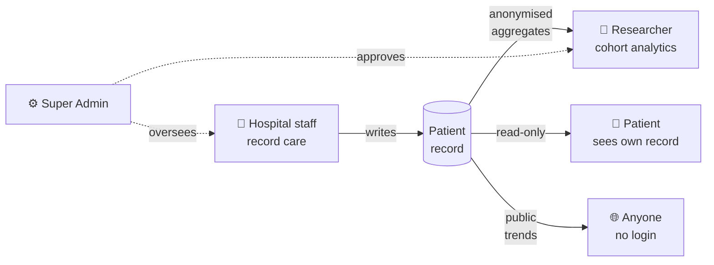
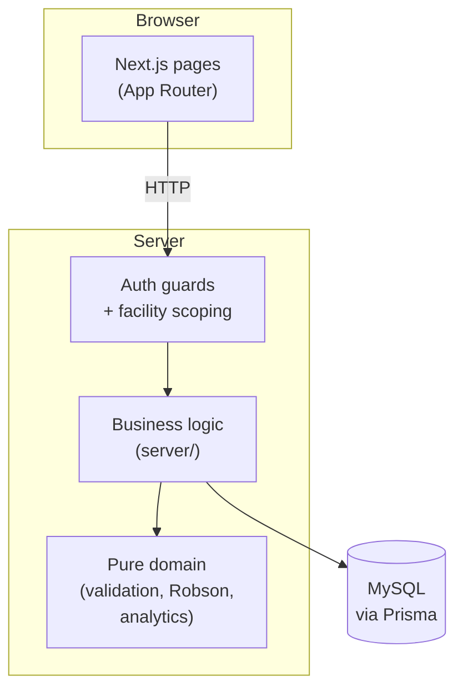

# MeeronBi — Antenatal Care Data Analytics

[](https://github.com/varunbalaji167/MeeronBi/actions/workflows/ci.yml)
[](https://codecov.io/gh/varunbalaji167/MeeronBi)

**[Live demo →](https://meeronbi-test.eikhoi.net)**

MeeronBi is a platform for antenatal care — one connected record from first
visit to delivery, built so hospital staff, patients, and approved researchers
each see their part of it. It is designed to
scale to many facilities, states, and countries.

## Who uses it



| Role | Access |
|---|---|
| **Hospital staff** | Create and edit patient records at their own facility. |
| **Patient** | Read-only view of their own record. |
| **Researcher** | Aggregate analytics only — never per-patient data. Access is reviewed. |
| **Super Admin** | Cross-facility oversight and researcher approval. |
| **Public** | A `/public/trends` page with aggregate statistics only. |

## Architecture at a glance



Three ideas carry most of the design:

1. **One tenant boundary, enforced in one place.** Every row touching patient
   data is scoped by `facilityId`; the guard layer refuses cross-facility
   access without even confirming the record exists.
2. **A framework-free domain layer.** Clinical rules, validation, and
   anonymisation live in plain TypeScript with no database or React imports,
   so they are unit-testable without any setup.
3. **Aggregates only for research and public pages.** Analytics queries pass
   through disclosure control that suppresses small cells, so a cohort can
   never be narrowed down to one patient.

Full layout, dependency rules, and a "where does X go" table live in
[`docs/ARCHITECTURE.md`](docs/ARCHITECTURE.md).

## Stack


CI/CD is health-checked with automatic rollback on a failed release.

## Quick start

```bash
npm install
cp .env.example .env       # fill in DATABASE_URL, NEXTAUTH_SECRET, SEED_* accounts
npx prisma migrate dev
npm run seed               # idempotent demo data
npm run dev                # http://localhost:3000
```

The seed creates one of each account type (super admin, hospital admin,
patient portal, researchers in each review state) and two patient records —
one complete, one draft — so every screen has real data on first load. The
seeded logins print to the console; the full table of accounts lives in
[`docs/DEPLOYMENT.md`](docs/DEPLOYMENT.md).

For production setup — email, Google sign-in, zero-downtime deploys — see
[`docs/DEPLOYMENT.md`](docs/DEPLOYMENT.md).

## Tests & CI

```bash
npm run verify     # lint + typecheck + unit tests (what CI runs)
npm run security   # secret scan + SAST + dependency audit
```

Three parallel CI gates run on every push: `verify`, a full `app` gate (real
migrations, real build, smoke-tested on a booted instance), and `security`.
A green `main` deploys automatically and rolls itself back on a failed health
check. Scope and reasoning: [`docs/TESTING.md`](docs/TESTING.md).

## Learn more

| Doc | What's in it |
|---|---|
| [`docs/ARCHITECTURE.md`](docs/ARCHITECTURE.md) | Code layout, layers, "where does X go" |
| [`docs/SCALING_PLAN.md`](docs/SCALING_PLAN.md) | Foundation plan, known gaps, phased roadmap |
| [`docs/ANALYTICS.md`](docs/ANALYTICS.md) | Design reference for the analytics feature |
| [`docs/DEPLOYMENT.md`](docs/DEPLOYMENT.md) | Production setup, deploys, rollback |
| [`docs/RUNBOOK.md`](docs/RUNBOOK.md) | Symptom → fix for CI, deploy, and production |
| [`docs/TESTING.md`](docs/TESTING.md) | Test strategy and CI gates |
| [`docs/INPUT_VALIDATION.md`](docs/INPUT_VALIDATION.md) | Field-by-field input/validation audit |
| [`docs/OPERATIONS.md`](docs/OPERATIONS.md) | Backup/restore policy decisions |
| [`CLAUDE.md`](CLAUDE.md) | Session primer for Claude Code — reads first |
